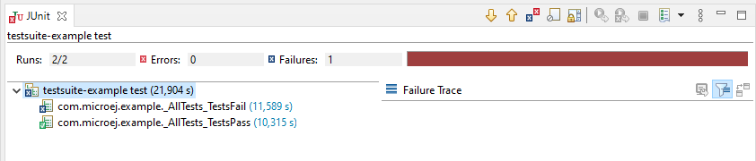

# Overview

This project is a simple MicroEJ library example which implements JUnit tests.

Please refer to https://docs.microej.com/en/latest/ApplicationDeveloperGuide/testsuite.html for more details on automated testsuites.

# Project Structure

* `src/main/java` contains library classes that are going to be tested.
* `src/main/resources` contains library resources (images, fonts, etc.).
* `src/test/java` contains test classes.
* `src/test/resources` contains test resources.
* `src-adpgenerated/junit/java` contains classes and resources generated by the JUnit processor.

# Requirements

* MicroEJ SDK ``5.4.0`` or higher.
* Internet connection to MicroEJ Central Repository.

# Usage

## Run the Tests

By default, tests are automatically executed at build-time on the Simulator 
See `module.ivy` for the Platform dependency.

To build the library:

* Right click on the `ExampleJava-TestSuite` example,
* Click on `Build Module`.

Wait until the build is terminated. You should get the following error:

```
* Problem Report:

Error : The following error occurred while executing this line:

Cause : At least one test has failed. See logs in [xxx]/ExampleJava-TestSuite/target~/test/xml for details
```

## Get Test Results

A test suite report is available 

- in HTML format at `/ExampleJava-TestSuite/target~/test/html/test/junit-noframes.html`.
- in XML format at `/ExampleJava-TestSuite/target~/test/xml/TEST-test-report.xml`.

In MicroEJ SDK, you can open the XML file in JUnit view as follows:

- Right-click on the `/ExampleJava-TestSuite/target~/test/xml/TEST-test-report.xml` file,
- Select `Open With` > `JUnit View` menu item.

You should get the following test report:




## Add a Test

From MicroEJ SDK, you can create a new JUnit class as follows:

- Right-click on the `src/test/java` folder,
- Select `New` > `Other...`  menu item,
- Select the `Java` > `JUnit` > `JUnit Test Case` wizard,
- Enter a test name,
- Press Finish. 

A new JUnit test case class is created with a default failing test case.

Refer to the [JUnit testing framework documentation](https://junit.org/junit4/) to learn more about it.

# Dependencies

_All dependencies are retrieved transitively by MicroEJ Module Manager_.

# Source

N/A.

# Restrictions

None.

---
_Markdown_  
_Copyright 2021 MicroEJ Corp. All rights reserved._  
_Use of this source code is governed by a BSD-style license that can be found with this software._  


